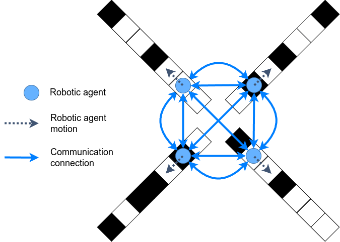
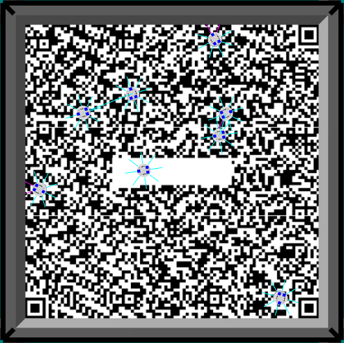

# Sensor Degradation Filters for Minimalistic Collective Perception
## Introduction
This repository provides the code to simulate the experiments shown in [Adaptive Self-Calibration for Minimalistic Collective Perception by Imperfect Robot Swarms](https://arxiv.org/abs/2410.21546) and in [BayesCPF: Enabling Collective Perception in Robot Swarms with Degrading Sensors]().

Two simulators are provided here:
1. Python-based static topology simulator, and
2. ARGoS3-based dynamic topology simulator.

### Static topology simulation
The robots in the static topology simulator do not move in the normal sense and have fixed communication channels with its neighbors (the communication network is specified by the user). In each simulated experiment, a fixed number of robots would traverse their own black and white tile-track and communicate periodically with their neighbors. The figure belows illustrates what it would look like for 4 robots.
<p align="center">

</p>

### Dynamic topology simulation
The robots in the dynamic topology simulator move around a square arena of black and white tiles. In each simulated experiment, a fixed number of robots would randomly move around the arena and communicate with neighbors within their proximity. The figure below is a screenshot of the simulation for 8 robots on a QR code used in the physical experiments.
<p align="center">

</p>

## Requirements
- Python 3.8+, `pip`, and `python3-venv` - _the code here was tested on Python 3.8 (Ubuntu 20.04) and Python 3.12 (Ubuntu 24.04)_
- CMake 3.15+
- [ARGoS3](https://github.com/ilpincy/argos3.git) - _recommended to be built from source_
- [ARGoS3-KheperaIV plugin](https://github.com/ilpincy/argos3-kheperaiv) - _can only be built from source_
- [GSL 2.5+](https://www.gnu.org/software/gsl/) - _can be installed using `apt install libgsl-dev` or built from source_
- [NLopt 2.9.0+](https://github.com/stevengj/nlopt) - _can only be built from source_

## Installation
First, ensure that all requirements are satisfied and clone this repository. Then run the subsequent commands in the project root directory.

### Static topology simulation and data visualization
This optional subsection installs the Python simulator and utilities to visualize the data. You may skip it if you don't intend to run the static topology simulation and prefer to parse the JSON data files with your own code.
1. Create a virtual environment.
    ```
    $ python3 -m venv .venv
    ```
2. Activate the environment and install Python requirements.
    ```
    $ source .venv/bin/activate
    $ pip install -r requirements.txt # python 3.8; if python 3.12 use 'requirements_python3-12.txt' instead
    ```

### Dynamic topology simulation
Make and build the project by doing:
```
$ mkdir build_argos # recommended over 'build' as 'pip install .' uses the 'build' directory
$ cd build_argos
$ cmake ..
$ make
```

## Execution
In both the static and dynamic simulations, the data will be stored as JSON files in an automatically created directory. Each JSON file corresponds to a single trial. The directory name is assigned based on the specified experimental parameters with date and time.

### Static topology experiments
1. Set up the desired experimental parameters as shown [here](docs/parameter_file_setup.md).
2. Activate the Python virtual environment.
    ```
    $ source .venv/bin/activate
    ```
3. Run the simulation.
    ```
    $ run_static_degradation_experiment.py <YML-PARAM-FILE>
    ```
    Script help:
    ```
    usage: run_static_degradation_experiment.py [-h] [-p] [--verbose] FILE

    Execute multi-agent simulation with static topologies and static degradation.

    positional arguments:
    FILE        path to the parameter file relative to the current/execution directory

    options:
    -h, --help  show this help message and exit
    -p          flag to use cores to run simulations in parallel
    --verbose   flag to run with verbose output
    ```

### Dynamic topology experiments
1. Set up the desired experimental parameters as shown [here](docs/parameter_file_setup.md).
2. Run the simulation.
    ```
    $ run_dynamic_topo_simulations -c <ARGOS-PARAM-FILE>
    ```

## Visualization of experiment data
Once the simulation completes, you can parse the JSON data files yourself to visualize the data.

Alternatively, this repository contains utility functions in Python to process and plot the data. The method of choice is to use them in a Jupyter notebook for data visualization. See [here](docs/utility_scripts_functions.md) for detailed instructions on the utility functions.


## For NEST Lab users
### Running physical robot experiments
For the ASDF work, no additional work needs to be done. The robot controllers are run on the server which can used the controllers compiled here.

For the BayesCPF work, you will need to cross-compile the robot controller. The controller code here is not adjusted for compilation on the actual Khepera IV robots, but I created a [dedicated repository](https://github.com/khaiyichin/sensor-degradation-filter-real-kheperaiv.git) just for that. You do not need to clone the repository manually; it is included as this repository as a submodule. Simply do
```
$ git submodule update --init --recursive
```
and the repository should appear in the `real_kheperaiv_controller/sensor-degradation-filter-real-kheperaiv/` directory.

#### Cross-compile
To cross-compile the executable and libraries for the Khepera IV robots, follow the instructions in the controller repository's [README](./real_kheperaiv_controller/sensor-degradation-filter-real-kheperaiv/README.md).

#### Rebuild loop functions
One may ask: _"Why care about running loop functions at all if the robots run their controllers locally? Won't the robots run without intervention for the ARGoS server?"_ While it is true that the controller shouldn't require any interaction with the ARGoS server, a loop functions class&mdash;run on the ARGoS server&mdash;lets us enforce a decentralized communication scheme (it's technically partially decentralized). The ARGoS server is also useful in becoming a common location to store all the robots' data.

Rebuild this project with the `-DBUILD_REAL_KHEPERAIV_EXPERIMENT_LOOP_FUNCTIONS=True` flag.
```
$ cd build_argos
$ cmake .. -DBUILD_REAL_KHEPERAIV_EXPERIMENT_LOOP_FUNCTIONS=True
$ make
```

See [here](docs/parameter_file_setup.md#argos-server-configuration-file) on how to configure and run the `.argos` file for the real robot experiments.

### FAQ

- On the ARGoS server, it may streamline the experiment workflow if you use Terminator with multiple terminals, each SSH'd onto a different Khepera IV robot. You can use `Super` + `T` to broadcast the commands you type in a single terminal to all the others. _(You may need to do `ibus exit` if you encounter the issue where the other terminals have duplicated letters to your commands.)_

- You might encounter the "Error binding socket server at port number 8204: Address already in use" message on the ARGoS server when you terminate and restart the program in quick succession. Wait for 15-30 seconds for the socket to clear, and then try running ARGoS again.

- On the Vicon server (the Windows machine), it's best to _only_ check the objects that correspond to the Khepera IV robots in the experiment, in the Vicon Tracker program. Otherwise, the Vicon may accidentally pick up unrelated object which will break the loop functions.